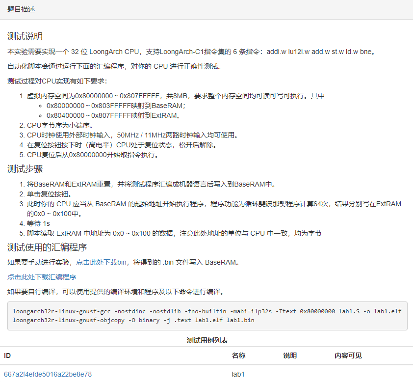
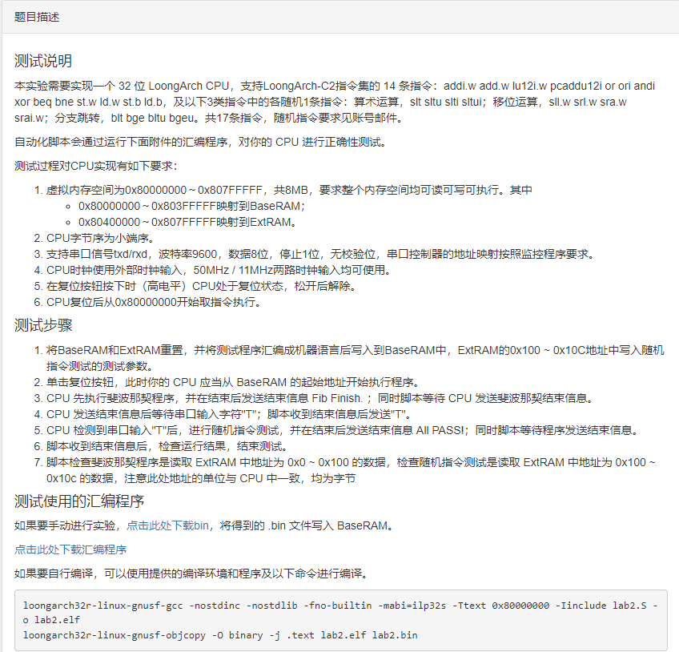
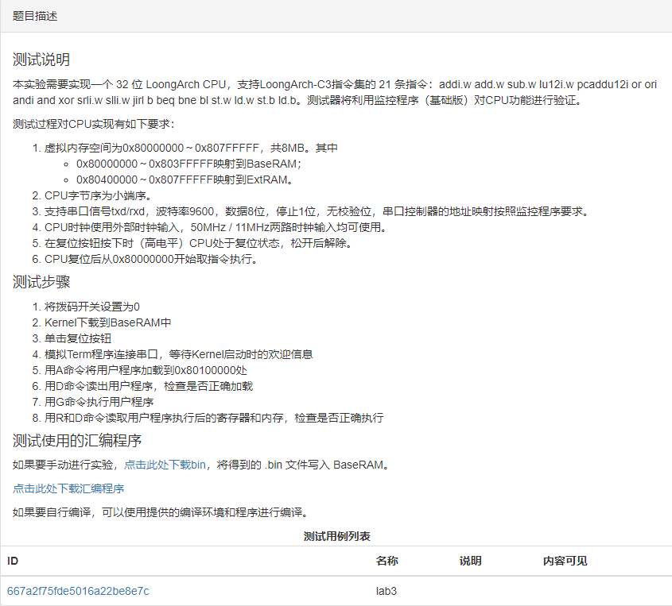
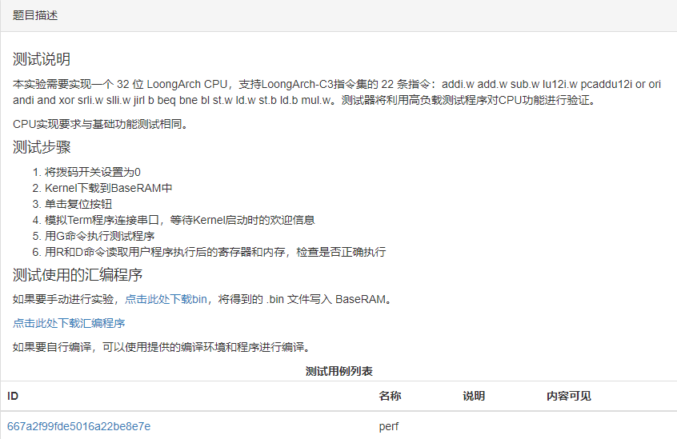

# 个人赛初赛比赛内容
## 自动评测
### lab1


自动评测脚本：
```py
import struct
from TestcaseBase import *
import binascii
import os
import time

class Testcase(TestcaseBase):

    def onStart(self):
        +Reset  # Press reset button
        # init memory using random data
        BaseRAM[:] = MEM_RAND_INIT
        ExtRAM[:] = MEM_RAND_INIT
        # load test program at 0x00000000
        BaseRAM[::True] = TEST_PROGRAM
        -Reset
        # wait for test program running
        time.sleep(1)
        # read result
        result = ExtRAM[:0x100:False]
        # self.log(binascii.hexlify(result).decode('ascii'))
        # self.log(binascii.hexlify(MEM_ANSWER).decode('ascii'))

        fib_correct = struct.unpack('<'+'I'*64, MEM_ANSWER)
        fib_result = struct.unpack('<'+'I'*64, result)

        # compare result
        addr = errors = 0
        for ret, ans in zip(fib_result, fib_correct):
            if ret != ans:
                self.log(f'ExtRAM[0x{addr:03x}] should be 0x{ans:08x}, get 0x{ret:08x}')
                errors += 1
            addr += 4

        if errors == 0:
            self.log('Test pass')
            self.score = 1
        else:
            self.log('Test not pass')
            self.score = 0

        # end test
        self.finish(self.score)
        return True


# compiled test program
TEST_PROGRAM = binascii.unhexlify(
    '0C0480020D04800204800015850084028E351000AC018002CD0180028E008029'
    '8F008028CF0D005C8410800285E4FF5F8000005C'
)

# random data for ram init
MEM_RAND_INIT = os.urandom(4096)

# correct answer in ram
MEM_ANSWER = binascii.unhexlify(
    '020000000300000005000000080000000d000000150000002200000037000000'
    '5900000090000000e90000007901000062020000db0300003d060000180a0000'
    '551000006d1a0000c22a00002f450000f16f000020b500001125010031da0100'
    '42ff020073d90400b5d8070028b20c00dd8a1400053d2100e2c73500e7045700'
    'c9cc8c00b0d1e300799e700129705402a20ec503cb7e19066d8dde09380cf80f'
    'a599d619dda5ce29823fa5435fe5736de12419b1400a8d1e212fa6cf613933ee'
    '8268d9bde3a10cac650ae66948acf215adb6d87ff562cb95a219a415977c6fab'
    '399613c1d012836c09a9962dd9bb199ae264b0c7bb20ca619d857a2958a6448b'
)
```
### lab2


自动评测脚本：
```py
#=# oj.run_time.max = 40000

from TestcaseBase import *
import random
import traceback
import enum
import time
import struct
import binascii
import os
from timeit import default_timer as timer

class Ins(enum.Flag):
    SLT = enum.auto()
    SLTU = enum.auto()
    SLTI = enum.auto()
    SLTUI = enum.auto()

    SLL_W = enum.auto()
    SRL_W = enum.auto()
    SRA_W = enum.auto()
    SRAI_W = enum.auto()

    BLT = enum.auto()
    BGE = enum.auto()
    BLTU = enum.auto()
    BGEU = enum.auto()

class Testcase(TestcaseBase):
    class State(enum.Enum):
        Fib = 1
        Random = 2

    fibInfo = b'Fib Finish.'
    feedInfo = b'All PASS!'
    recvBuf = b''
    score = 0
    selection = 0
    result = 0x55555555
    rnd = random.getrandbits(32)

    def check(self):
        fib_correct = struct.unpack('<'+'I'*64, MEM_ANSWER)
        fib_result = struct.unpack('<'+'I'*64, ExtRAM[:0x100:False])
        addr = errors = 0
        for ret, ans in zip(fib_result, fib_correct):
            if ret != ans:
                self.log(f'ExtRAM[0x{addr:03x}] should be 0x{ans:08x}, get 0x{ret:08x}')
                errors += 1
            addr += 4
        if errors == 0:
            self.score += 0.3
            self.log('Fib Pass!')
        else:
            self.log('Fib Fail!')

        rdata = struct.unpack('<III', ExtRAM[0x100: 0x100+3*4: False])
        self.log("RandomTest Results: " + " ".join([hex(v) for v in rdata]))
        if rdata[1] != self.selection or rdata[2] != self.rnd:
            self.log('RandomTest Fail, Values have been accidentally changed.')
        elif rdata[0] == self.result:
            self.log('RandomTest Fail, Test program hasn\'t been executed.')
        else:
            self.result = rdata[0] ^ self.rnd
            if self.result >> 16 != 0xfeed or self.result & 0xffff != self.selection:
                self.log(f'RandomTest Fail, Invalid result code: {self.result:#08x}')
            else:
                self.log('RandomTest Pass!')
                self.score += 0.4

    def endTest(self):
        self.finish(self.score)
        return True

    def stateChange(self, received: bytes):
        if self.state == self.State.Fib:
            self.log(f"Fib info: {str(self.recvBuf)[1:]}")
            if received != self.fibInfo:
                self.log('ERROR: Fib incorrect info')
                return self.endTest()
            elif len(self.recvBuf) > len(self.fibInfo):
                self.log('WARNING: Fib extra bytes received')

            self.state = self.State.Random
            self.recvBuf = b''
            self.expectedLen = len(self.feedInfo)
            Serial << b'T'

        elif self.state == self.State.Random:
            self.log(f"RandomTest info: {str(self.recvBuf)[1:]}")
            if received != self.feedInfo:
                self.log('ERROR: RandomTest incorrect info')
                return self.endTest()
            elif len(self.recvBuf) > len(self.feedInfo):
                self.log('WARNING: RandomTest extra bytes received')

            self.score = 0.3
            self.check()
            return self.endTest()

    @Serial  # On receiving from serial port
    def recv(self, dataBytes):
        self.recvBuf += dataBytes
        while len(self.recvBuf) >= self.expectedLen:
            end = self.stateChange(self.recvBuf[:self.expectedLen])
            if end:
                break

    @Timer
    def timeout(self):
        self.log(f"ERROR: timeout during {self.state.name}")
        self.endTest()

    @started
    def initialize(self):
        user = USERNAME.split("-")
        if user[0] != "2024" and USERNAME != "root":
            self.log('This test isn\'t for you.')
            return self.endTest()
        if USERNAME != "root":
            for i in RandomTest_TABLE[user[2]]:
                self.selection |= i.value
        else:
            self.selection = 0xfff

        self.state = self.State.Fib
        self.expectedLen = len(self.fibInfo)
        self.log(f"Arguments: {hex(self.result)} {hex(self.selection)} {hex(self.rnd)}")
        DIP << 0
        +Reset
        BaseRAM[:] = MEM_RAND_INIT
        ExtRAM[:] = MEM_RAND_INIT
        BaseRAM[::True] = TEST_PROGRAM
        ExtRAM[0x100::True] = struct.pack('<III', self.result, self.selection, self.rnd)
        Serial.open(1, baud=9600)
        -Reset
        Timer.oneshot(30000)  # timeout in 30 seconds


# compiled test program
TEST_PROGRAM = binascii.unhexlify(
    '001c00584669622046696e6973682e00416c6c2050415353210000000c048002'
    '0d04800204800015850084028e351000ac018002cd0180028e0080298f008028'
    'cffd085c8410800285e4ff5f17a07f151800001c18d3be020403002818078002'
    'ecf20f288c05400380f9ff5be4e20f290403002880e8ff5fecf20f288c094003'
    '80f9ff5be4e20f280c5081028cecff5f17800015f702840318001500f9128028'
    'fa2280282c074003806900586c8ae4148ca985030d6af014adc19b030b048003'
    '8a3512004b4d005c2c60ec158cada9030d0015000b0480038a3512004b35005c'
    '0c001500cd7ceb15ad01bb030b0015008a3512004b1d005c0c0015000d001500'
    '0b0015008a3512004b09005c180780032c0b4003806900584c1e2b148ca5ac03'
    '0d388414ad09a9030b0480038ab512004b4d005c4c95ab148c81b2030d001500'
    '0b0015008ab512004b35005c0c0015002df6a515adf1af030b0480038ab51200'
    '4b1d005c0c0015000d0015000b0015008ab512004b09005c180b80032c134003'
    '805100584ca2b3158cd5a6030b0480038a2126024b3d005c2cc774158c319803'
    '0b0480038a0100024b29005c0c0015000b0015008ad93b024b19005c0c001500'
    '0b0015008a0100024b09005c181380032c23400380510058cca984158c618f03'
    '0b0015008aa551024b3d005c8c3ae3148ca192030b0015008a0140024b29005c'
    '0c0015000b0480038a9558024b19005c0c0015000b0015008a0140024b09005c'
    '182380032c43400380690058acb7f3148cd1ac030d1c80032bdbdb156b01a803'
    '8a3517004b4d005cac7764148c01a0030d001500ab7764146b01a0038a351700'
    '4b31005c0c0015000d7880030b0015008a3517004b1d005c0c0015000d001500'
    '0b0015008a3517004b09005c184380032c83400380610058cc1e3f140d708003'
    '0b0480038ab517004b4d005cecbf95148c91a5030d001500ebbf95146b91a503'
    '8ab517004b31005c0c0015000d2880030b0015008ab517004b1d005c0c001500'
    '0d0015000b0015008ab517004b09005c188380032c034103806900588cb27c14'
    '8c018c030d0c80034b960f146b81a1038a3518004b4d005c6c8780148cb9a703'
    '0d0015006b8780146bb9a7038a3518004b31005c0c0015000d1480030b001500'
    '8a3518004b1d005c0c0015000d0015000b0015008a3518004b09005c18038103'
    '2c034203805900580c01fc148cc18f030b7e00146b0581038aa548004b41005c'
    '0ccdec148c21bb030bcdec146b21bb038a8148004b29005c0c0015000b001500'
    '8afd48004b19005c0c0015000b0015008a8148004b09005c180382032c034403'
    '804901580f00150010001500001400586fc3db15ef81b6038d21006000240058'
    'ecb4a7148c9199036d76a115ad0d99038de1ff63000c005830092315107a9503'
    '1c0015001d001500fc01015c1dfe005c0f00150010001500001400588fd98d15'
    'ef91a6038d210060002400580c2b90158cb981032d3f3b14ad5594038de1ff63'
    '000c0058701ade141012a5039cd98d159c93a6037d1ade14bd13a503fcad005c'
    '1daa005c0f0015001000150000140058ef3d7f15ef55a4038d21006000240058'
    '8c6aef148c5599036d718e14ad09b4038de1ff63000c0058b0885c15108e9703'
    '1c0015001d001500fc61005c1d5e005c0f00150010001500001400584f925a14'
    'ef099d038d210060002400588c9572158c1998038dca9114ade1ac038de1ff63'
    '000c0058108be01510c6b1035c925a149c0b9d031d8be015bdc7b103fc0d005c'
    '1d0a005c180384032c034803804901580f00150010001500001400586f645215'
    'efc195038d210064002400584cb224158cf9b7036d74f414ad6d97038de1ff67'
    '000c005830145b15104688031c0015001d001500fc01015c1dfe005c0f001500'
    '1000150000140058eff2c915ef519e038d210064002400586c15fe148cc1ad03'
    'ad30f315ad49a3038de1ff67000c005870ccdf151076b903fcf2c9159c539e03'
    '7dccdf15bd77b903fcad005c1daa005c0f00150010001500001400584f63a415'
    'ef719a038d210064002400586cd5ae148cc9ba03ad803015adf1ae038de1ff67'
    '000c0058d02fbb14101a9d035c63a4159c739a03dd2fbb14bd1b9d03fc59005c'
    '1d56005c0f00150010001500001400586f730215ef8185038d21006400240058'
    'ac869e158c41a103cd164c14ad9d9e038de1ff67000c0058d0d44a15105e9903'
    '1c0015001d001500fc0d005c1d0a005c180388032c035003805101580f001500'
    '1000150000140058aff51014efa99c038d21006800240058ec0a5c158c019903'
    'ede74715ad5181038de1ff6b000c005850eef21510029e031c0015001d001500'
    'fc09015c1d06015c0f0015001000150000140058cfddbe14eff1af038d210068'
    '002400582c6642158c1dbc030d0f9d15ad55a1038de1ff6b000c0058f0e6f715'
    '10f2be03dcddbe149cf3af03fde6f715bdf3be03fcb5005c1db2005c0f001500'
    '1000150000140058af311a14eff189038d21006800240058cca702158cc99403'
    '2d04c815ad71b4038de1ff6b000c0058d0baf615100eaf03bc311a149cf38903'
    'ddbaf615bd0faf03fc61005c1d5e005c0f0015001000150000140058af495314'
    'ef99b0038d210068002400588c8035148c51a9036dd18915ad3dbf038de1ff6b'
    '000c0058303fff1510529603bc4953149c9bb0033d3fff15bd539603fc0d005c'
    '1d0a005c180390032c036003805101580f0015001000150000140058ef704d14'
    'ef2d80038d21006c002400580c527c148c85ad030dfb3a15ad0daa038de1ff6f'
    '000c0058d0fcb715109693031c0015001d001500fc09015c1d06015c0f001500'
    '10001500001400588f58c715ef5d86038d21006c002400588cbefa158c258003'
    '2d59ff14ad7d96038de1ff6f000c00587001d81410f6be039c58c7159c5f8603'
    '7d01d814bdf7be03fcb5005c1db2005c0f0015001000150000140058ef4ad015'
    'ef0d9d038d21006c00240058aced23158ca5a003ad2d4d14ad19bc038de1ff6f'
    '000c0058b0e7491510fabf03fc4ad0159c0f9d03bde74915bdfbbf03fc61005c'
    '1d5e005c0f0015001000150000140058cf091c14effd95038d21006c00240058'
    '2c65f9148c899703eda75314ad7993038de1ff6f000c005850c35f151086a003'
    'dc091c149cff95035dc35f15bd87a003fc0d005c1d0a005c1803a0030cdafd15'
    '8c6115008ce91500ec0280291933005c17a07f15f8ffff1d18f39b0204030028'
    '18078002ecf20f288c05400380f9ff5be4e20f290403002880e8ff5f00000058'
)

# random data for ram init
MEM_RAND_INIT = os.urandom(4096)

# correct answer in ram
MEM_ANSWER = binascii.unhexlify(
    '020000000300000005000000080000000d000000150000002200000037000000'
    '5900000090000000e90000007901000062020000db0300003d060000180a0000'
    '551000006d1a0000c22a00002f450000f16f000020b500001125010031da0100'
    '42ff020073d90400b5d8070028b20c00dd8a1400053d2100e2c73500e7045700'
    'c9cc8c00b0d1e300799e700129705402a20ec503cb7e19066d8dde09380cf80f'
    'a599d619dda5ce29823fa5435fe5736de12419b1400a8d1e212fa6cf613933ee'
    '8268d9bde3a10cac650ae66948acf215adb6d87ff562cb95a219a415977c6fab'
    '399613c1d012836c09a9962dd9bb199ae264b0c7bb20ca619d857a2958a6448b'
)

RandomTest_TABLE = {
    "01": [Ins.SLT, Ins.SLL_W, Ins.BGEU],
    "02": [Ins.SLTU, Ins.SRA_W, Ins.BLTU],
    "03": [Ins.SLTI, Ins.SRA_W, Ins.BLTU],
    "04": [Ins.SLTU, Ins.SRAI_W, Ins.BGEU],
    "05": [Ins.SLTU, Ins.SRL_W, Ins.BLTU],
    "06": [Ins.SLTUI, Ins.SRA_W, Ins.BLT],
    "07": [Ins.SLTI, Ins.SLL_W, Ins.BLT],
    "08": [Ins.SLT, Ins.SLL_W, Ins.BGE],
    "09": [Ins.SLTU, Ins.SRAI_W, Ins.BLT],
    "10": [Ins.SLTI, Ins.SRL_W, Ins.BLTU],
    "11": [Ins.SLT, Ins.SRL_W, Ins.BLTU],
    "12": [Ins.SLT, Ins.SRAI_W, Ins.BLTU],
    "13": [Ins.SLTU, Ins.SRA_W, Ins.BLT],
    "14": [Ins.SLTI, Ins.SRA_W, Ins.BGEU],
    "15": [Ins.SLTUI, Ins.SRAI_W, Ins.BLT],
    "16": [Ins.SLTUI, Ins.SLL_W, Ins.BGEU],
    "17": [Ins.SLTU, Ins.SRL_W, Ins.BGE],
    "18": [Ins.SLTI, Ins.SLL_W, Ins.BGE],
    "19": [Ins.SLTU, Ins.SLL_W, Ins.BLTU],
    "20": [Ins.SLTUI, Ins.SRA_W, Ins.BGE],
    "21": [Ins.SLTI, Ins.SLL_W, Ins.BGEU],
    "22": [Ins.SLT, Ins.SRL_W, Ins.BLT],
    "23": [Ins.SLT, Ins.SRA_W, Ins.BGE],
    "24": [Ins.SLTU, Ins.SRA_W, Ins.BGEU],
    "25": [Ins.SLTUI, Ins.SRL_W, Ins.BGEU],
    "26": [Ins.SLTU, Ins.SLL_W, Ins.BGEU],
    "27": [Ins.SLTI, Ins.SRAI_W, Ins.BGE],
    "28": [Ins.SLT, Ins.SRL_W, Ins.BGE],
    "29": [Ins.SLT, Ins.SRAI_W, Ins.BLT],
    "30": [Ins.SLTI, Ins.SRA_W, Ins.BGE],
    "31": [Ins.SLT, Ins.SRAI_W, Ins.BGEU],
    "32": [Ins.SLTI, Ins.SRAI_W, Ins.BLTU],
    "33": [Ins.SLTUI, Ins.SRL_W, Ins.BGE],
    "34": [Ins.SLTU, Ins.SRL_W, Ins.BGEU],
    "35": [Ins.SLT, Ins.SLL_W, Ins.BLTU],
    "36": [Ins.SLTU, Ins.SRA_W, Ins.BGE],
    "37": [Ins.SLTI, Ins.SRL_W, Ins.BGEU],
    "38": [Ins.SLTI, Ins.SRL_W, Ins.BGE],
    "39": [Ins.SLTI, Ins.SRL_W, Ins.BLT],
    "40": [Ins.SLT, Ins.SRA_W, Ins.BLT],
    "41": [Ins.SLTI, Ins.SLL_W, Ins.BLTU],
    "42": [Ins.SLTU, Ins.SRL_W, Ins.BLT],
    "43": [Ins.SLT, Ins.SRA_W, Ins.BGEU],
    "44": [Ins.SLTUI, Ins.SRL_W, Ins.BLTU],
    "45": [Ins.SLTU, Ins.SRAI_W, Ins.BLTU],
    "46": [Ins.SLTI, Ins.SRAI_W, Ins.BLT],
    "47": [Ins.SLTUI, Ins.SLL_W, Ins.BLT],
    "48": [Ins.SLTU, Ins.SRAI_W, Ins.BGE],
    "49": [Ins.SLTUI, Ins.SLL_W, Ins.BGE],
    "50": [Ins.SLTUI, Ins.SRA_W, Ins.BGEU],
    "51": [Ins.SLTU, Ins.SLL_W, Ins.BLT],
    "52": [Ins.SLTUI, Ins.SRAI_W, Ins.BGE],
    "53": [Ins.SLTUI, Ins.SRAI_W, Ins.BGEU],
    "54": [Ins.SLT, Ins.SRL_W, Ins.BGEU],
    "55": [Ins.SLT, Ins.SLL_W, Ins.BLT],
    "56": [Ins.SLT, Ins.SRA_W, Ins.BLTU],
    "57": [Ins.SLTU, Ins.SLL_W, Ins.BGE],
    "58": [Ins.SLT, Ins.SRAI_W, Ins.BGE],
    "59": [Ins.SLTUI, Ins.SRAI_W, Ins.BLTU],
    "60": [Ins.SLTUI, Ins.SRL_W, Ins.BLT],
    "61": [Ins.SLTI, Ins.SRA_W, Ins.BLT],
    "62": [Ins.SLTUI, Ins.SRA_W, Ins.BLTU],
    "63": [Ins.SLTI, Ins.SRAI_W, Ins.BGEU],
    "64": [Ins.SLTUI, Ins.SLL_W, Ins.BLTU]
}
```

### lab3

自动测试脚本：
```py
#=# oj.resources.kernel_bin = http://127.0.0.1:8003/nscscc/la/kernel/kernel.bin
#=# oj.run_time.max = 40000

from TestcaseBase import *
import random
import traceback
import enum
import time
import struct
import binascii
import base64
from timeit import default_timer as timer

class Testcase(TestcaseBase):
    class State(enum.Enum):
        WaitBoot = enum.auto()
        RunA = enum.auto()
        RunD = enum.auto()
        RunG = enum.auto()
        WaitG = enum.auto()
        RunR = enum.auto()
        RunD2 = enum.auto()
        Done = enum.auto()

    bootMessage = b'MONITOR for Loongarch32 - initialized.'
    recvBuf = b''

    @staticmethod
    def int2bytes(val):
        return struct.pack('<I', val)

    @staticmethod
    def bytes2int(val):
        return struct.unpack('<I', val)[0]

    def endTest(self):
        if self.state == self.State.WaitBoot:
            score = 0
        elif self.state == self.State.RunD:
            score = 0.3
        elif self.state in [self.State.RunG, self.State.WaitG]:
            score = 0.5
        elif self.state == self.State.RunR:
            score = 0.7
        elif self.state == self.State.RunD2:
            score = 0.8
        elif self.state == self.State.Done:
            score = 1

        self.finish(score)
        return True

    def stateChange(self, received: bytes):
        addr = 0x80100000
        if self.state == self.State.WaitBoot:
            bootMsgLen = len(self.bootMessage)
            self.log(f"Boot message: {str(self.recvBuf)[1:]}")
            if received != self.bootMessage:
                self.log('ERROR: incorrect message')
                return self.endTest()
            elif len(self.recvBuf) > bootMsgLen:
                self.log('WARNING: extra bytes received')
            self.recvBuf = b''

            self.state = self.State.RunA
            for i in range(0, len(USER_PROGRAM), 4):
                Serial << b'A'
                Serial << self.int2bytes(addr+i)
                Serial << self.int2bytes(4)
                Serial << USER_PROGRAM[i:i+4]
            self.log("User program written")

            self.state = self.State.RunD
            self.expectedLen = len(USER_PROGRAM)
            Serial << b'D'
            Serial << self.int2bytes(addr)
            Serial << self.int2bytes(len(USER_PROGRAM))

        elif self.state == self.State.RunD:
            self.log(f"  Program Readback:\n  {binascii.hexlify(self.recvBuf).decode('ascii')}")
            if received != USER_PROGRAM:
                self.log('ERROR: corrupted user program')
                return self.endTest()
            elif len(self.recvBuf) > len(USER_PROGRAM):
                self.log('WARNING: extra bytes received')
            self.recvBuf = b''
            self.log("Program memory content verified")

            self.state = self.State.RunG
            Serial << b'G'
            Serial << self.int2bytes(addr)
            self.expectedLen = 1

        elif self.state == self.State.RunG:
            if received == b'\x80':
                self.log('ERROR: exception occurred')
                return self.endTest()
            elif received != b'\x06':
                self.log('ERROR: start mark should be 0x06')
                return self.endTest()
            self.recvBuf = self.recvBuf[1:]
            self.time_start = timer()
            self.state = self.State.WaitG
            self.expectedLen = 1

        elif self.state == self.State.WaitG:
            self.recvBuf = self.recvBuf[1:]
            if received == b'\x80':
                self.log('ERROR: exception occurred')
                return self.endTest()
            elif received == b'\x07':
                elapsed = timer() - self.time_start
                self.log(f'Program elapsed time: {elapsed:.3f}s')

                self.state = self.State.RunR
                self.recvBuf = b''
                self.expectedLen = 31*4
                Serial << b'R'

        elif self.state == self.State.RunR:
            regList = [self.bytes2int(received[i:i+4])
                       for i in range(0, 31*4, 4)]
            self.log('\n'.join([f"  R{i+1} = {regList[i]:08x}"
                                for i in range(31)]))
            for pair in REG_VERIFICATION:
                if regList[pair[0]-1] != pair[1]:
                    self.log(f"ERROR: R{pair[0]} should equal {pair[1]:08x}")
                    return self.endTest()
            self.recvBuf = b''
            self.log("Register value verified")

            self.state = self.State.RunD2
            self.expectedLen = len(MEM_VERIFICATION)
            Serial << b'D'
            Serial << self.int2bytes(0x80400000)
            Serial << self.int2bytes(len(MEM_VERIFICATION))

        elif self.state == self.State.RunD2:
            self.log(f"  Data Readback:\n  {binascii.hexlify(self.recvBuf).decode('ascii')}")
            if received != MEM_VERIFICATION:
                self.log('ERROR: data memory content mismatch')
                return self.endTest()
            elif len(self.recvBuf) > len(MEM_VERIFICATION):
                self.log('WARNING: extra bytes received')
            self.recvBuf = b''
            self.log("Data memory content verified")

            self.state = self.State.Done
            return self.endTest()

    @Serial # On receiving from serial port
    def recv(self, dataBytes):
        self.recvBuf += dataBytes
        while len(self.recvBuf) >= self.expectedLen:
            end = self.stateChange(self.recvBuf[:self.expectedLen])
            if end:
                break

    @Timer
    def timeout(self):
        self.log(f"ERROR: timeout during {self.state.name}")
        self.endTest()

    @started
    def initialize(self):
        self.state = self.State.WaitBoot
        self.expectedLen = len(self.bootMessage)
        DIP << 0
        +Reset
        BaseRAM[:] = base64.b64decode(RESOURCES['kernel_bin'])
        Serial.open(1, baud=9600) # NSCSCC
        # Serial.open(0, baud=9600) # THU
        -Reset
        Timer.oneshot(20000) # timeout in 20 seconds

USER_PROGRAM = binascii.unhexlify( # in Little-Endian
    # ###### User Program Assembly ######
    # __start:
    '0C048002' # addi.w      $t0,$zero,0x1   # t0 = 1
    '0D048002' # addi.w      $t1,$zero,0x1   # t1 = 1
    '04800015' # lu12i.w     $a0,-0x7fc00    # a0 = 0x80400000
    '85808002' # addi.w      $a1,$a0,0x20    # a1 = 0x80400020

    # loop:
    '8E351000' # add.w       $t2,$t0,$t1     # t2 = t0+t1
    'AC018002' # addi.w      $t0,$t1,0x0     # t0 = t1
    'CD018002' # addi.w      $t1,$t2,0x0     # t1 = t2
    '8E008029' # st.w        $t2,$a0,0x0
    '84108002' # addi.w      $a0,$a0,0x4     # a0 += 4
    '85ECFF5F' # bne         $a0,$a1,loop
    '2000004C' # jirl        $zero,$ra,0x0
)
REG_VERIFICATION = [(4, 0x80400020), (5, 0x80400020), (12, 0x22), (13, 0x37), (14, 0x37)]
MEM_VERIFICATION = binascii.unhexlify(
    '020000000300000005000000080000000d000000150000002200000037000000')
```

### 性能测试

自动测试脚本：
```py
#=# oj.resources.kernel_bin = http://127.0.0.1:8003/nscscc/la/kernel/kernel.bin
#=# oj.resources.matrix_bin = http://127.0.0.1:8003/nscscc/la/perf/matrix.bin
#=# oj.resources.crypto_bin = http://127.0.0.1:8003/nscscc/la/perf/crypto.bin
#=# oj.board.n = 3
#=# oj.run_time.max = 40000

from TestcaseBase import *
import random
import traceback
import enum
import time
import struct
import binascii
import base64
from timeit import default_timer as timer


class Testcase(TestcaseBase):
    class State(enum.Enum):
        WaitBoot = enum.auto()
        RunA = enum.auto()
        RunD = enum.auto()
        RunG = enum.auto()
        WaitG = enum.auto()
        Verify = enum.auto()
        Done = enum.auto()

    bootMessage = b'MONITOR for Loongarch32 - initialized.'
    runTimeLimit = 15000 # 15s
    recvBuf = b''
    elapsed = -1

    @staticmethod
    def int2bytes(val):
        return struct.pack('<I', val)

    @staticmethod
    def bytes2int(val):
        return struct.unpack('<I', val)[0]

    def endTest(self, timeout=False) -> bool:
        if self.state == self.State.WaitBoot:
            score = 0
        elif self.state == self.State.RunD:
            score = 0.1
        elif self.state in (self.State.RunG, self.State.WaitG):
            score = 0.3
        elif self.state == self.State.Verify:
            score = 0.5
        if self.state == self.State.Done:
            score = 1

        if self.state in (self.State.WaitG, self.State.Verify, self.State.Done):
            if self.elapsed < 0:
                self.elapsed = timer() - self.time_start
            self.log(
                f"Test {self.utest[0]} run for {self.elapsed:.3f}s {'(Timeout)' if timeout else ''}")

        self.finish(score, {
            'details': {
                'name': self.utest[0],
                'max': self.runTimeLimit//1000,
                'elapsed': self.elapsed
            }
        })
        return True

    def stateChange(self, received: bytes) -> bool:
        addr = 0x80100000
        if self.state == self.State.WaitBoot:
            bootMsgLen = len(self.bootMessage)
            self.log(f"Boot message: {str(self.recvBuf)[1:]}")
            if received != self.bootMessage:
                self.log('ERROR: incorrect message')
                return self.endTest()
            elif len(self.recvBuf) > bootMsgLen:
                self.log('WARNING: extra bytes received')
            self.recvBuf = b''

            self.state = self.State.RunA
            for i in range(0, len(self.test_bin), 4):
                Serial << b'A'
                Serial << self.int2bytes(addr+i)
                Serial << self.int2bytes(4)
                Serial << self.test_bin[i:i+4]
            self.log("User program written")

            self.state = self.State.RunD
            self.expectedLen = len(self.test_bin)
            Serial << b'D'
            Serial << self.int2bytes(addr)
            Serial << self.int2bytes(len(self.test_bin))

        elif self.state == self.State.RunD:
            self.log(f"  Program Readback:\n  {binascii.hexlify(self.recvBuf).decode('ascii')}")
            if received != self.test_bin:
                self.log('ERROR: corrupted user program')
                return self.endTest()
            elif len(self.recvBuf) > len(self.test_bin):
                self.log('WARNING: extra bytes received')
            self.recvBuf = b''
            self.log("Program memory content verified")

            self.state = self.State.RunG
            Serial << b'G'
            Serial << self.int2bytes(addr)
            self.expectedLen = 1

        elif self.state == self.State.RunG:
            if received == b'\x80':
                self.log('ERROR: exception occurred')
                return self.endTest()
            elif received != b'\x06':
                self.log('ERROR: start mark should be 0x06')
                return self.endTest()
            self.recvBuf = self.recvBuf[1:]
            self.time_start = timer()
            self.state = self.State.WaitG
            self.expectedLen = 1
            Timer.oneshot(self.runTimeLimit)

        elif self.state == self.State.WaitG:
            self.recvBuf = self.recvBuf[1:]
            if received == b'\x80':
                self.log('ERROR: exception occurred')
                return self.endTest()
            elif received == b'\x07':
                self.elapsed = timer() - self.time_start
                self.state = self.State.Verify

                if self.verifyTestData():
                    self.log("Data memory content verified")
                    self.state = self.State.Done
                else:
                    self.log("ERROR: Data memory content mismatch")
                return self.endTest()
            else:
                self.log(f"ERROR: Invalid byte 0x{received[0]:x} received")
                return self.endTest()

    @Serial # On receiving from serial port
    def recv(self, dataBytes):
        self.recvBuf += dataBytes
        while len(self.recvBuf) >= self.expectedLen:
            end = self.stateChange(self.recvBuf[:self.expectedLen])
            if end:
                break

    @Timer
    def timeout(self):
        self.log(f"ERROR: timeout during {self.state.name}")
        self.endTest(True)

    @started
    def initialize(self):
        self.utest = UTEST_ENTRY[IBOARD]
        self.state = self.State.WaitBoot
        self.expectedLen = len(self.bootMessage)
        self.log(f"=== Test {self.utest[0]} ===")
        kernel_bin = base64.b64decode(RESOURCES['kernel_bin'])
        off, size = self.utest[1], self.utest[2]
        self.test_bin = kernel_bin[off : off+size]
        DIP << 0
        +Reset
        self.preloadTestData()
        BaseRAM[:] = kernel_bin
        Serial.open(1, baud=9600) # NSCSCC
        -Reset
        # booting timeout in 10 seconds
        Timer.oneshot(10000)

    def preloadTestData(self):
        if self.utest[0] == 'STREAM':
            self.testdata = bytes(random.getrandbits(8) for _ in range(0x300000))
            BaseRAM[0x100000::False] = self.testdata
        elif self.utest[0] == 'MATRIX':
            self.testdata = base64.b64decode(RESOURCES['matrix_bin'])
            ExtRAM[:0x30000:False] = self.testdata[:0x30000]
        elif self.utest[0] == 'CRYPTONIGHT':
            self.testdata = base64.b64decode(RESOURCES['crypto_bin'])

    def verifyTestData(self) -> bool:
        if self.utest[0] == 'STREAM':
            return ExtRAM[0x40:0x300000:False] == self.testdata[0x40:0x300000]
        elif self.utest[0] == 'MATRIX':
            return ExtRAM[0x20000:0x30000:False] == self.testdata[0x30000:]
        elif self.utest[0] == 'CRYPTONIGHT':
            return ExtRAM[:0x200000:False] == self.testdata

# > make ON_FPGA=y
# 1:80003000 <UTEST_SIMPLE>:
# 2:8000300c <UTEST_STREAM>:
# 3:8000303c <UTEST_MATRIX>:
# 4:800030c4 <UTEST_CRYPTONIGHT>:
# 5:8000315c <UTEST_1PTB>:
# 6:80003190 <UTEST_2DCT>:
# 7:800031d8 <UTEST_3CCT>:
# 8:80003204 <UTEST_4MDCT>:

#              name, offset in kernel.bin, length
UTEST_ENTRY = [('STREAM', 0x3008, 0x28),
                ('MATRIX', 0x3030, 0x84),
                ('CRYPTONIGHT', 0x30b4, 0x94)]
```