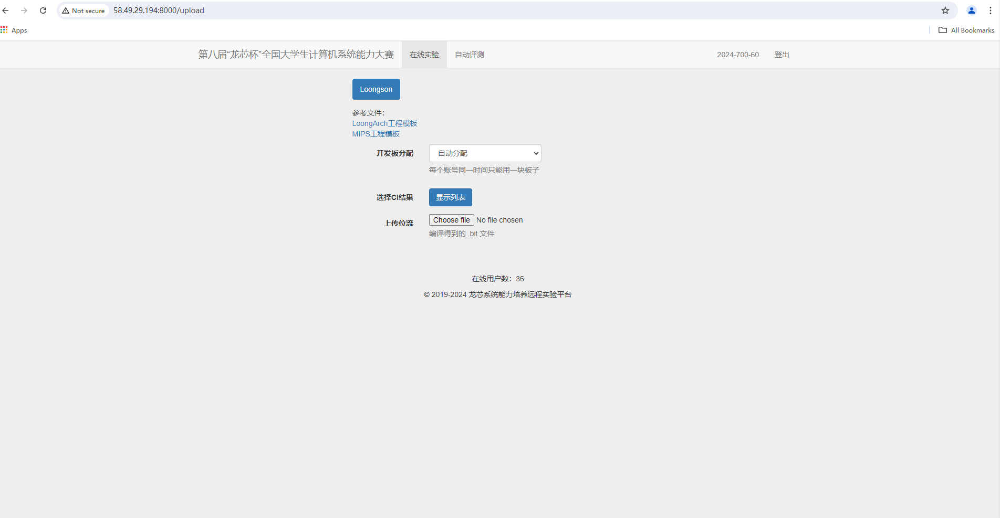
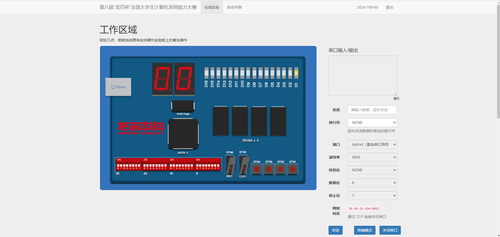
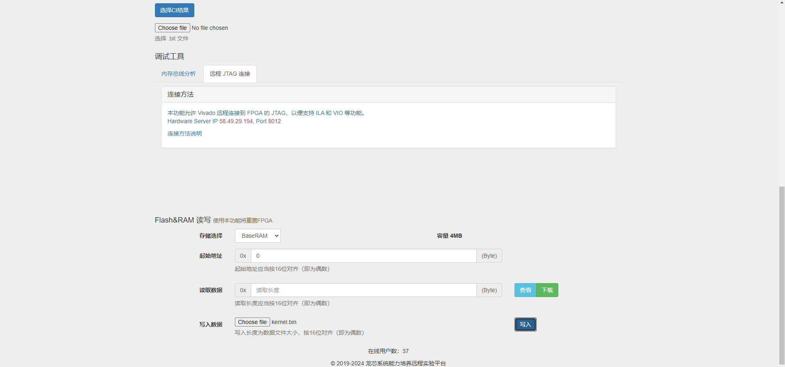
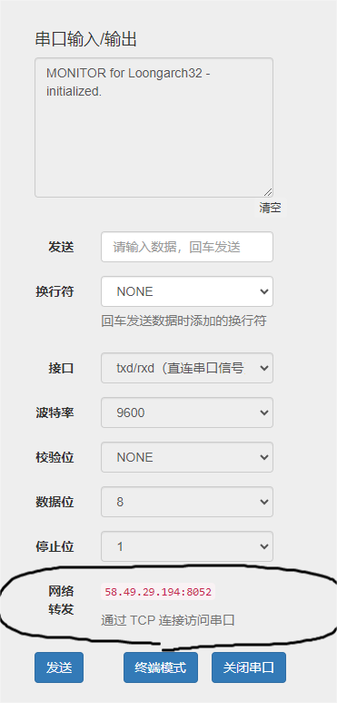
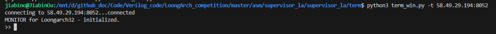
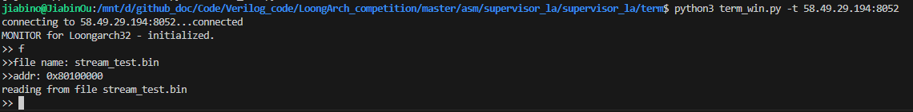
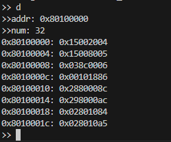
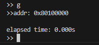

# term程序使用步骤
## 一、进入龙芯在线实验平台

进入到龙芯在线实验平台后，将写好的比特流文件写入到平台里，然后会自动跳转到板子的模拟界面。

将`kernel.bin`烧入BaseRAM中，

然后运行term_win.py, -t参数填写网络转发地址

运行成功之后再按一下上面的reset按键，就能看到初始化输出了。(前提是串口能正常工作)

常见命令包括:
- f:加载本地的二进制文件到相应地址，需要加上起始地址

- d:查看起始地址给定长度的内容(长度以字节个数为单位)

- g:运行起始地址开始的程序
