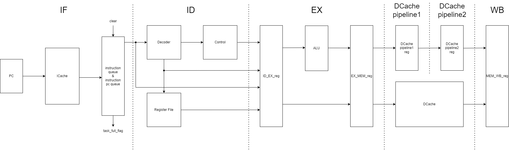
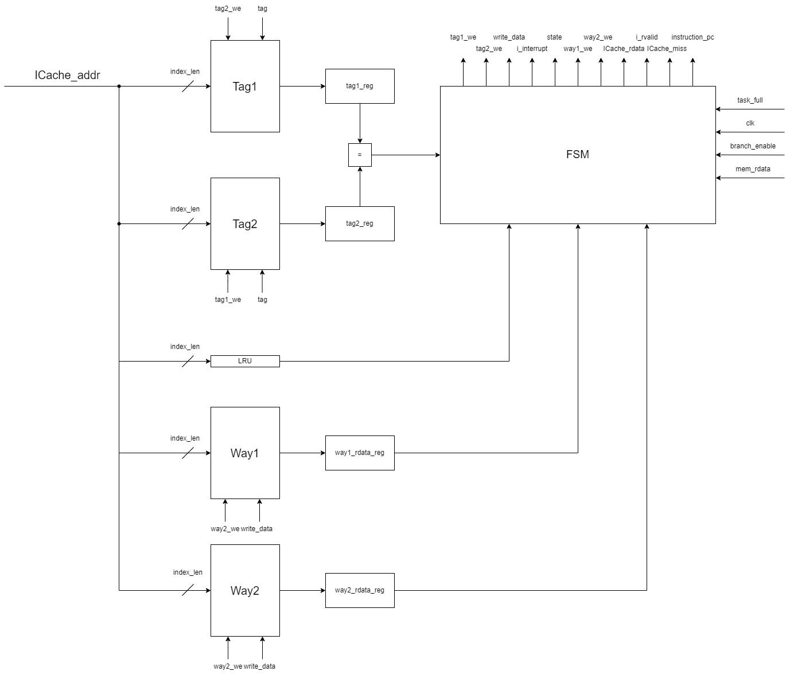
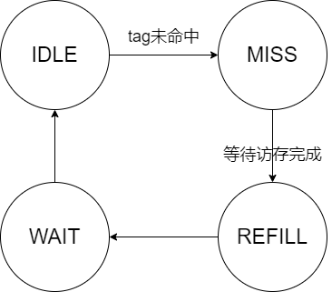
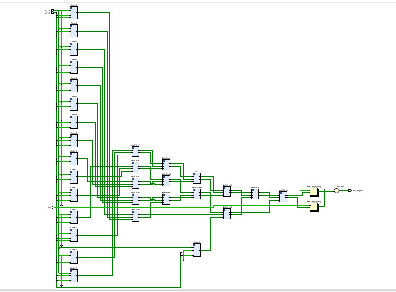
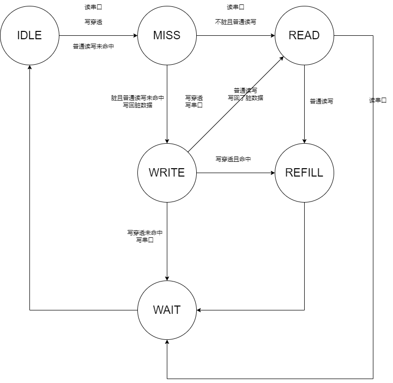
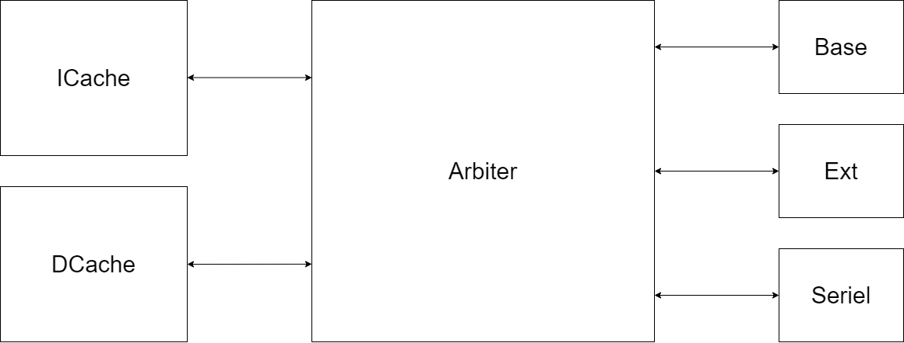
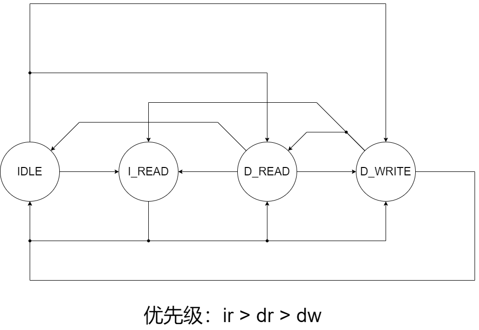

# LoongArch_CPU设计文档
中国科学技术大学 PB22111667 区家彬

## 简介
本设计文档旨在详细介绍本人设计的龙芯架构CPU，主要从CPU的总体结构设计、实现细节这两个方面进行阐述。

## CPU总体架构
CPU的总体架构分为IF段、ID段、EX段、DCache_pipeline1段、DCache_pipeline2段以及WB段共6段。

### 一、IF段
IF段包含了以下模块：
#### PC模块
PC模块主要是确定下一个取指令的地址，相关的信号说明及模块示意图如下：


##### 端口说明

| 名称           | 类型    | 位宽   | 方向  | 说明                          |
|----------------|---------|--------|-------|-------------------------------|
| branch_enable  | input   | 1      | 输入  | 选择线                        |
| pc_enable      | input   | 1      | 输入  | PC 迭代使能                   |
| clk            | input   | 1      | 输入  | 时钟                          |
| rstn           | input   | 1      | 输入  | 复位                          |
| pc_jump        | input   | 32     | 输入  | 用于计算跳转地址的加法器       |
| pc             | output  | 32     | 输出  | 输出当前 PC                   |


它的主要迭代逻辑是**以跳转条件作为选择信号**。若跳转，则下一个周期更新的地址为跳转的目标地址；若不跳转，则内部pc进行自增操作。

#### ICache
ICache模块主要是存储从主存最近读出的数据，拥有比主存更快的访问速度，可以在访问命中的情况下减少访问的时间，相关的信号说明及模块示意图如下：

##### 端口说明
| 参数名     | 位宽  | 说明       |
|------------|-------|------------|
| Offset_len | 6     | 偏移长度   |

| 名称            | 类型    | 位宽                                  | 方向  | 说明                              |
|-----------------|---------|---------------------------------------|-------|-----------------------------------|
| clk             | input   | 1                                     | 输入  | 时钟信号                          |
| rstn            | input   | 1                                     | 输入  | 低电平初始化信号                  |
| ICache_addr     | input   | 32                                    | 输入  | 取指的 PC                         |
| mem_rdata       | input   | (1 << (3 + Offset_len)) - 1           | 输入  | 通过仲裁器获取的内存数据          |
| i_rready        | input   | 1                                     | 输入  | 仲裁器读就绪信号                  |
| branch_enable   | input   | 1                                     | 输入  | CPU 指令执行跳转                  |
| task_full       | input   | 1                                     | 输入  | 任务队列任务数已满标志            |
| ICache_miss     | output  | 1                                     | 输出  | 指令缓存未命中信号                |
| ICache_rdata    | output  | 32                                    | 输出  | 缓存读取的数据                    |
| i_addr          | output  | 32                                    | 输出  | 发送给仲裁器的读地址              |
| i_rvalid        | output  | 1                                     | 输出  | 发送给仲裁器的读请求有效信号      |
| instruction_pc  | output  | 32                                    | 输出  | 读出指令对应的 PC                 |
##### 设计思路
内存的访问时间比较长，相比之下在cpu内部的内存访问比较快，因此需要在cpu内部设置一个缓存区域，它的访问速度比主存要快，并且根据一定的换入换出策略，能够让访问缓存接近直接访问主存的命中率。
这里采用**两路组相联**的方式组织缓存，标签(Tag)与数据块(Way)都使用**简单双端口写优先块式存储器**作为存储单元。

###### 替换策略
这里采用的替换策略是**最近最少被使用换出(Least Recent Used)**的策略。如上面结构图所示，LRU寄存器记录着最近使用的情况。每个块的地址对应一个一位的寄存器。之所以设计成一位，是因为这里采用的是两路组相联的组织方式，对于某个地址的LRU，要么是第一路最近被使用，要么是第二路最近被使用，比较结果恰好只有两个状态，可以被一位进行表示(例如LRU为0时表示第一路最近被使用，1为第二路最近被使用)。而如果采用四路及以上(记为$n$路)时，由于多路的使用时间比较结果有$n!$种，此时LRU就不能用一位进行表示，需要用多位进行维护。考虑到LRU的开销比较大，且二路组相联的命中率已经足够了，因此采用两路组相联，并使用一位的LRU寄存器记录最近使用的一路。

###### ICache状态机
ICache的状态转换图如下：

各状态的活动如下：
- IDLE: 流水线流动，并检查是否命中。如果命中则继续流动；如果不命中，则进入MISS状态等待数据读出来
- MISS: 等待读就绪信号到来；
- REFILL：将写使能信号置高，让读到的数据写入；
- WAIT：更新输出数据，更新tag表与LRU计数器。
  
具体的实现代码如下：
```verilog
//state 状态机
always @(posedge clk) begin
    if(!rstn) begin
        state <= `IDLE;         
    end
    else begin
        if (state != `IDLE & branch_enable) begin   
            state <= `IDLE;     // 当CPU发出跳转信号时，如果正在取指令，取出来的指令大概率是不会执行的，因此这里将其状态打断，回到空闲状态以继续流水线的流动，冲刷掉前两级错误流水
        end
        else if(state == `IDLE & ICache_miss & !branch_enable & !branch_enable_reg) begin 
            state <= `MISS;     // 空闲且没有被跳转打断时，进入等待数据的状态
        end 
        else if (state == `MISS & mem_read_finish) begin
            state <= `REFILL;   // 等待访存完成
        end
        else if (state == `REFILL)begin
            state <= `WAIT;     // 等待写回
        end
        else if(state == `WAIT) begin
            state <= `IDLE;
        end
    end
end
```
###### 流水线停顿处理
对于读未命中或者任务取满了的情形，此时还没有进入MISS状态，此时外部的pc_enable还在生效，会导致即使内部流水线停了，但pc仍然会多一个周期变化，这时如果不存储从块存储器读出的way_data和tag的话，后续会被最新进入且卡住的pc读出的内瓤冲刷掉，因此需要在刚进入MISS的状态时对读出的数据进行保存，后续用于恢复。

###### 相关控制信号的说明
- i_rvalid: 读请求，在IDLE状态下未命中时置高，在MISS状态下读取完毕置低；
- wayi_we(i=1,2)：写使能，在FEFILL状态下置高，根据LRU计数器选择way1还是way2的使能；
- i_interrupt：用于将仲裁器置高的读请求信号置为0(打断仲裁器的指令读)，在状态不为空闲且跳转的情况下置高；
  
###### 相关数据的更新
数据的更新分为以下几种情况：
- 当IDLE且命中时，tag_reg和wayi_rdata_reg直接更新为从块式存储器读出的东西
- 当IDLE且未命中时，锁住流水线；
- 当REFILL时，被写入的一路更新tag_reg和way_rdata_reg，以适配流水。
  
#### 指令队列
指令队列的设计初衷是为了缓解由于DCache的执行阻塞与ICache的取指阻塞叠加，队列相当于一个缓冲区，DCache与ICache可借助缓冲区各自工作，减少互相阻塞的时间。
指令队列采取的是FIFO结构，其状态管理如下：
- 任务数为0时：如果ICache取出指令，则加入到指令队列；
- 任务数不为0时：判断是否为满，如果队列已满且前面流水已阻塞，则将task_full置为1，拒绝接收指令；如果不为满，则在ICache取出指令时加入到队尾。
- 当跳转时：清空所有队列的指令。

相关实现代码如下：
```verilog
// 任务数计数器
always @(posedge clk) begin
  if(!rstn | (branch_enable & !load_use_stop)) begin
    task_count <= 0;
  end
  else begin
    if(~|branch_count) begin
      if(task_count == 0 & !ICache_miss & ~|branch_count) begin  
        task_count <= 1;
      end
      else if(task_count == (1 << Queue_count_len) - 1 && !DCache_miss & !load_use_stop) begin
        task_count <= task_count - 1;
      end
      else if((!ICache_miss & !DCache_miss & !load_use_stop) | (ICache_miss & load_use_stop & !DCache_miss)) begin
        task_count <= task_count;
      end
      else if(ICache_miss & !DCache_miss & !load_use_stop) begin
        if(task_count > 0) begin
          task_count <= task_count - 1;
        end
      end
      else if(!ICache_miss & (DCache_miss | (!DCache_miss & DCache_miss_reg) | load_use_stop) & ~|branch_count) begin
        if(task_count < (1 << Queue_count_len) - 1) begin
          task_count <= task_count + 1;
        end
      end 
      
    end
  end
end

// 从ICache取出的指令
always @(posedge clk) begin 
  integer i;
  if(!rstn | (branch_enable & !load_use_stop)) begin
    for(i = 0; i < (1 << Queue_count_len); i++) begin
      instruction_queue[i] <= 0;
    end
  end
  else begin
    if(!ICache_miss & task_count == 0) begin
      instruction_queue[task_count] <= ICache_rdata;
    end
    else if(!ICache_miss & !DCache_miss & !load_use_stop) begin 
      for(i = 0; i < task_count - 1; i++) begin
        instruction_queue[i] <= instruction_queue[i + 1];
      end
      instruction_queue[task_count - 1] <= ICache_rdata;
    end
    else if(ICache_miss & !DCache_miss & !load_use_stop) begin //ICache_miss 
      if(task_count > 0) begin
        for(i = 0; i < task_count - 1; i++) begin
          instruction_queue[i] <= instruction_queue[i + 1];
        end
      end
    end
    else if(!ICache_miss & (DCache_miss | (!DCache_miss & DCache_miss_reg) | load_use_stop) & ~|branch_count) begin
      if(task_count < (1 << Queue_count_len) - 1) begin
        instruction_queue[task_count] <= ICache_rdata;
      end
    end
  end
end
    
// 指令对应的pc
always @(posedge clk) begin
  integer i;
  if(!rstn | (branch_enable & !load_use_stop)) begin     //branch时丢弃延迟槽所有的指令对应的pc
    for(i = 0; i < (1 << Queue_count_len); i++) begin
      instruction_pc_queue[i] <= 0;
    end
  end
  else begin
    if(!ICache_miss & task_count == 0) begin
      instruction_pc_queue[task_count] <= instruction_pc;
    end
    else if(!ICache_miss & !DCache_miss & !load_use_stop) begin 
      for(i = 0; i < task_count - 1; i++) begin
        instruction_pc_queue[i] <= instruction_pc_queue[i + 1];
      end
      instruction_pc_queue[task_count - 1] <= instruction_pc;
    end
    else if(ICache_miss & !DCache_miss & !load_use_stop) begin //ICache_miss 
      if(task_count > 0) begin
        for(i = 0; i < task_count - 1; i++) begin
          instruction_pc_queue[i] <= instruction_pc_queue[i + 1];
        end
      end
    end
    else if(!ICache_miss & (DCache_miss | (!DCache_miss & DCache_miss_reg) | load_use_stop)) begin
      if(task_count < (1 << Queue_count_len) - 1) begin
        instruction_pc_queue[task_count] <= instruction_pc;
      end
    end
  end
end
```
### 二、ID段
ID段包含了以下模块：

#### 译码器
译码器主要的作用是将32位指令读入，根据LoongArch指令集标准进行指令的翻译，包括寄存器、立即数，并输出编码结果，方便后面进行使用。

##### 端口说明
| 名称           | 类型    | 位宽  | 方向  | 说明                      |
|----------------|---------|-------|-------|---------------------------|
| Instruction    | input   | 32    | 输入  | 待解码的指令              |
| rk             | output  | 5     | 输出  | 读取寄存器 k 的地址        |
| rj             | output  | 5     | 输出  | 读取寄存器 j 的地址        |
| rd             | output  | 5     | 输出  | 写入寄存器 d 的地址        |
| imm            | output  | 32    | 输出  | 立即数                     |
| control_bus    | output  | 6     | 输出  | 控制总线信号               |

##### 具体实现
1. 寄存器地址提取
根据指令的操作码，判断是否需要提取相应的寄存器地址，并将提取出的地址分配给对应的输出端口rk、rj和rd。
```verilog
assign rk = ({5{Instruction[31:15] == add_code      || 
                Instruction[31:15] == sub_code      || 
                ...
                Instruction[31:15] == mulw_code}
                } 
                & Instruction[14:10]) ;
    
assign rj = ({5{Instruction[31:15] == add_code      || 
                Instruction[31:15] == sub_code      || 
                ...
                Instruction[31:26] == bltu_code     ||
                Instruction[31:26] == bgeu_code     }
                }
                & Instruction[9:5]);

assign rd = ({5{Instruction[31:15] == add_code      || 
                Instruction[31:15] == sub_code      || 
                Instruction[31:15] == slt_code      ||
                ...
                Instruction[31:25] == lu12i_code    ||
                Instruction[31:25] == pcaddu12i_code}
                }& Instruction[4:0])
                |
                ({5{Instruction[31:26] == bl_code}} & 5'h1);

```
2. 控制信号生成
根据指令的操作码，生成相应的控制信号，并分配给输出端口control_bus。
```verilog
assign control_bus =    ({6{Instruction[31:15] == add_code }}       & add_inst)         |
                        ({6{Instruction[31:15] == sub_code }}       & sub_inst)         |
                        ({6{Instruction[31:15] == slt_code }}       & slt_inst)         |
                        ...
                        ({32{Instruction[31:0] == nop_code}}        & nop_inst)         |
                        ({32{Instruction[31:0] == halt_code}}       & halt_inst);

```
3. 立即数的提取
   根据指令操作码，取不同的立即数位置。
```
assign imm =    ( {32{control_bus == addi_inst}}         & {{20{Instruction[21]}} ,Instruction[21:10]})                     |
                ( {32{control_bus == slti_inst}}         & {{20{Instruction[21]}} ,Instruction[21:10]})                     |
                ( {32{control_bus == sltui_inst}}        & {{20{Instruction[21]}} ,Instruction[21:10]})                     |
                ...
                ( {32{control_bus == blt_inst}}          & {{14{Instruction[25]}},Instruction[25:10],2'b0})                 |
                ( {32{control_bus == bge_inst}}          & {{14{Instruction[25]}},Instruction[25:10],2'b0})                 |
                ( {32{control_bus == bltu_inst}}         & {{14{Instruction[25]}},Instruction[25:10],2'b0})                 |
                ( {32{control_bus == bgeu_inst}}         & {{14{Instruction[25]}},Instruction[25:10],2'b0});
```
#### 控制信号生成模块
Control模块根据译码模块生成的control_bus信号生成相应的控制信号，包括ALU操作控制信号、内存读写使能信号和寄存器堆写使能信号。

##### 端口说明

| 端口名        | 位宽 | 方向  | 说明                                             |
|---------------|------|-------|--------------------------------------------------|
| `control_bus` | 6    | 输入  | 译码输出对应命令编码                             |
| `alu_ctrl`    | 5    | 输出  | ALU操作控制信号                                  |
| `mem_read`    | 1    | 输出  | 内存读使能信号                                  |
| `mem_write`   | 1    | 输出  | 内存写使能信号                                  |
| `rf_write`    | 1    | 输出  | 寄存器堆写使能信号                               |

具体实现代码与译码器类似，这里不再赘述。

#### 寄存器堆
寄存器堆主要用于存放cpu中需要暂时性存储的数据，比缓存的访问速度更快，经常被用于指令的源操作数来源。
这里实现的是写优先双端口简单寄存器堆，即当周期写入下周期读出的数据为刚写入的数据，而非之前存储的数据。

##### 端口说明
| 参数名       | 默认值 | 说明             |
|--------------|--------|------------------|
| `ADDR_WIDTH` | 5      | 地址的位宽       |
| `DATA_WIDTH` | 32     | 数据的位宽       |

| 端口名 | 位宽             | 方向  | 说明                |
|--------|------------------|-------|---------------------|
| `clk`  | 1                | 输入  | 时钟                |
| `ra0`  | `ADDR_WIDTH`     | 输入  | 读地址0             |
| `ra1`  | `ADDR_WIDTH`     | 输入  | 读地址1             |
| `rd0`  | `DATA_WIDTH`     | 输出  | 读数据0             |
| `rd1`  | `DATA_WIDTH`     | 输出  | 读数据1             |
| `wa`   | `ADDR_WIDTH`     | 输入  | 写地址              |
| `wd`   | `DATA_WIDTH`     | 输入  | 写数据              |
| `we`   | 1                | 输入  | 写使能              |

其实现代码如下：
```verilog
//读操作：读优先，异步读
reg [DATA_WIDTH -1:0]  rf [0:(1<<ADDR_WIDTH)-1];    //寄存器堆

assign rd0 = rf[ra0];   
assign rd1 = rf[ra1];
//写操作：同步写
always@ (posedge clk) begin
    if (we)  rf[wa] <= wa == 0 ? 0 : wd;  
end
```


### 三、EX段
EX段只有ALU这个模块，里面嵌套了一个乘法器模块。
#### 乘法器
乘法器的实现采用的是华莱士树结构以及两位Booth编码的技术。
##### 2位Booth编码
2位Booth编码可以通过有效的编码来缩减乘法中部分积的个数，由32个部分积转化为16个部分积。其原理为：
$$
-y_{31}\times 2^{31} + y_{30} \times 2^{30} + y_{29} \times 2^{29} + \cdots + y_1\times 2^1 + y_0 \times 2^0 \\
= (y_{29} + y_{30} - 2\times y_{31}) \times 2^{30} + (y_{27} + y_{28} - 2\times y_{29}) \times 2^{28} + \cdots  \\
 \ + (y_1 + y_2 - 2\times y_3) \times 2^2 + (y_{-1} + y_0 - 2\times y_1) \times 2^0
$$
因此采用如下编码表来使用乘数$y$对输入的被乘数$x$进行编码：

|$y_{i+1}$|$y_i$|$y_{i-1}$|编码|
|--------|---|-------|----|
|0       |0  | 0     |0   |
|0       |0  |1      | $x$|
|0       |1  |0      | $x$|
|0       |1  |1      | $2x$|
|1       |0  |0      | $-2x$|
|1       |0  |1      | $-x$|
|1       |1  |0      | $-x$|
|1       |1  |1      | 0|

具体的实现代码为：
```verilog
module coder(
    input y2, y1, y0,
    input [63:0] x,
    output reg [63:0] cout
    );
    wire [2:0] y = {y2, y1, y0};
    always @(*) begin
        if(y == 3'b011) begin // 2x
            cout = {x[62:0], 1'b0};
        end
        else if(y == 3'b100) begin // -2x
            cout = -{x[62:0], 1'b0};
        end     
        else if((y == 3'b001) | (y == 3'b010)) begin // x
            cout = x;
        end
        else if((y == 3'b101) | (y == 3'b110)) begin // -x
            cout = -x;
        end
        else begin // 0
            cout = 0;
        end
    end
endmodule
```
##### 保留进位加法器
除此之外，这里还用到保留进位加法器。保留进位加法器可以把三个数的和转化为两个数的和，这也是类似于二叉树的方法进行计算。每过一层保留进位加法器，部分和数量减少$\frac{2}{3}$，因此也只需要层保留进位加法器就可以完成计算。

保留进位加法器的实现如下：
```verilog
module tree(
    input [63:0] a, b, cin,
    output reg [63:0] cout, s
    );
    always @(*)begin
        s = a ^ b ^ cin;
        cout = ((a & b) | (b & cin) | (a & cin)) << 1;
    end
```

##### 华莱士树结构
华莱士树主要通过二叉树的思想将多项式级别的延迟时间降低至对数级别的延迟，其电路结构大致如下：

考虑到乘法器的组合逻辑延迟开销比较大，这里将乘法器内部切分了两级流水，将全加器之前的分为一级，全加器之后的寄存器分为一级。


#### ALU模块
ALU模块将输入的两个操作数的全部运算在一个或两个(乘法)周期内算出，然后通过选择线将结果选择出来。

##### 端口说明
| 端口名称  | 位宽        | 方向  | 描述                                              |
|:--------:|:-----------:|:----:|:-------------------------------------------------:|
| `Op1`    | 32位        | 输入  | 第一个操作数。表示ALU操作的第一个输入数据。              |
| `Op2`    | 32位        | 输入  | 第二个操作数。表示ALU操作的第二个输入数据。              |
| `alu_op`   | 5位         | 输入  | 控制信号。决定ALU执行的操作类型，如加法、减法、逻辑操作等。 |
| `clk`    | 1位         | 输入  | 时钟信号。用于乘法器流水操作。                          |
| `alu_res`| 32位        | 输出  | ALU的计算结果。表示ALU执行操作后的输出数据。              |

实现代码如下：
```verilog
assign {adder_cout, adder_result}   =   Op1 + ( Ctrl == sub_op      |
                                                Ctrl == slt_op      | 
                                                Ctrl == slti_op     | 
                                                Ctrl == sltu_op     |
                                                Ctrl == sltui_op    | 
                                                Ctrl == bgeu_op     | 
                                                Ctrl == bge_op      | 
                                                Ctrl == blt_op      | 
                                                Ctrl == bltu_op 
                                                ? ~Op2 + 1 :(Ctrl == bl_op | Ctrl == jirl_op ? 4 : Op2));

wire [31:0] slt_result              =   { {31{1'b0}}, ( Op1[31] & !Op2[31]) | (~(Op1[31] ^ Op2[31] ) & adder_result[31]) };
wire [31:0] sltu_result             =   { {31{1'b0}}, adder_cout };
wire [31:0] shift_src               =   Ctrl == slli_op | Ctrl == sll_op ? 
                                    {
                                        Op1[0],     Op1[1],     Op1[2],     Op1[3],
                                        Op1[4],     Op1[5],     Op1[6],     Op1[7],
                                        Op1[8],     Op1[9],     Op1[10],    Op1[11],
                                        Op1[12],    Op1[13],    Op1[14],    Op1[15],
                                        Op1[16],    Op1[17],    Op1[18],    Op1[19],
                                        Op1[20],    Op1[21],    Op1[22],    Op1[23],
                                        Op1[24],    Op1[25],    Op1[26],    Op1[27],                                    
                                        Op1[28],    Op1[29],    Op1[30],    Op1[31]
                                    }
                                    :   Op1;
wire [31:0] unsigned_mask           =   32'hffffffff >>> Op2;
wire [31:0] shift_result            =   ($signed(shift_src) >>> Op2) & unsigned_mask;

wire [31:0] srl_result              =   shift_result;
wire [31:0] sll_result              =  
                                    {
                                        shift_result[0],    shift_result[1],    shift_result[2],    shift_result[3],
                                        shift_result[4],    shift_result[5],    shift_result[6],    shift_result[7],
                                        shift_result[8],    shift_result[9],    shift_result[10],   shift_result[11],
                                        shift_result[12],   shift_result[13],   shift_result[14],   shift_result[15],
                                        shift_result[16],   shift_result[17],   shift_result[18],   shift_result[19],
                                        shift_result[20],   shift_result[21],   shift_result[22],   shift_result[23],
                                        shift_result[24],   shift_result[25],   shift_result[26],   shift_result[27],                                    
                                        shift_result[28],   shift_result[29],   shift_result[30],   shift_result[31]
                                    };
wire [31:0] signed_mask             =   ~({{32{Op1[31]}}} >>> Op2);
wire [31:0] sra_result              =   (Op1[31] ?  (srl_result | signed_mask) : srl_result);
wire [31:0] lu12i_result            =   {Op2[19:0],{12{1'b0}}};
wire [31:0] pcaddu12i_result        =   lu12i_result + Op1;//此时Op1选择pc线，Op2选择20位有符号数位扩展结果
assign alu_res                      =   ({32{Ctrl == add_op || Ctrl == addi_op || Ctrl == sub_op || Ctrl == bl_op || Ctrl == jirl_op}}      & adder_result)         |
                                        ({32{Ctrl == lu12i_op}}                                                                             & lu12i_result)         |
                                        ({32{Ctrl == pcaddu12i_op}}                                                                         & pcaddu12i_result)     |
                                        ({32{Ctrl == slt_op || Ctrl == slti_op }}                                                           & slt_result)           |
                                        ({32{Ctrl == sltu_op || Ctrl == sltui_op }}                                                         & sltu_result)          |
                                        ({32{Ctrl == and_op || Ctrl == andi_op}}                                                            & and_result)           |
                                        ({32{Ctrl == or_op || Ctrl == ori_op}}                                                              & or_result)            |
                                        ({32{Ctrl == nor_op}}                                                                               & nor_result)           |
                                        ({32{Ctrl == xor_op || Ctrl == xori_op}}                                                            & xor_result)           |
                                        ({32{Ctrl == sll_op || Ctrl == slli_op}}                                                            & sll_result)           |
                                        ({32{Ctrl == srl_op || Ctrl == srli_op}}                                                            & srl_result)           |
                                        ({32{Ctrl == sra_op || Ctrl == srai_op}}                                                            & sra_result)           |
                                        ({{31{1'b0}},{Ctrl == beq_op & Op1 == Op2}})                                                                                |
                                        ({{31{1'b0}},{Ctrl == bne_op & Op1 != Op2}})                                                                                |
                                        ({{31{1'b0}},{Ctrl == blt_op & slt_result[0]}})                                                                             |
                                        ({{31{1'b0}},{Ctrl == bge_op & !slt_result[0]}})                                                                            |
                                        ({{31{1'b0}},{Ctrl == bltu_op & sltu_result[0]}})                                                                           |
                                        ({{31{1'b0}},{Ctrl == bgeu_op & !sltu_result[0]}})                                                                          |
                                        ({32{Ctrl == mulw_op}}                                                                              & mul_l_result)
                                        ;
```

### 四、MEM段
这里的MEM段分为两级流水，主要是因为DCache内部有两级流水，为了同步，CPU中也需要适配相应的流水。MEM段主要的部件是DCache，它的结构与ICache类似，但是状态机有所不同。原本我设计的缓存更新策略是LRU+写回写分配，但是后面发现自动检测工具需要检查内存，写回写分配策略会导致主存的内容在命中的情况下得不到正确的更新，因此这里实现了对部分地址的写穿透。并且因为涉及到串口，串口的状态既可以被内部改变，也可以被外设改变，因此每次在读取串口相关的数据时，都当作未命中的情况进行处理。以下是DCache的状态转换图：


#### 端口说明

| 端口名称         | 位宽                                     | 方向  | 说明                                              |
|:---------------:|:----------------------------------------:|:----:|:-------------------------------------------------:|
| `clk`           | 1位                                      | 输入  | 时钟信号，用于同步DCache内部操作。                           |
| `rstn`          | 1位                                      | 输入  | 复位信号，低电平有效。                                      |
| `DCache_wdata`  | 32位                                     | 输入  | 需要写入DCache的数据，处理`st.b`、`st.h`指令。               |
| `DCache_addr`   | 32位                                     | 输入  | DCache地址，用于读写操作的地址。                             |
| `mem_read`      | 1位                                      | 输入  | CPU读请求信号，有效时发起读取操作。                          |
| `mem_write`     | 1位                                      | 输入  | CPU写请求信号，有效时发起写入操作。                          |
| `d_rready`      | 1位                                      | 输入  | 仲裁器的DCache读请求响应信号，响应完毕时有效。                |
| `d_wready`      | 1位                                      | 输入  | 仲裁器的DCache写请求响应信号，响应完毕时有效。                |
| `mem_rdata`     | `(1 << (3 + Offset_len)) - 1`位          | 输入  | 从仲裁器读到的数据，宽度根据`Offset_len`确定。                |
| `byte_write`    | 1位                                      | 输入  | 字节写使能信号，有效时写入单字节数据。                        |
| `half_word_write`| 1位                                     | 输入  | 半字写使能信号，有效时写入半字数据。                          |
| `word_write`    | 1位                                      | 输入  | 字写使能信号，有效时写入整字数据。                           |
| `d_rvalid`      | 1位                                      | 输出 | 发送给仲裁器的读请求有效信号。                              |
| `d_wvalid`      | 1位                                      | 输出 | 发送给仲裁器的写请求有效信号。                              |
| `d_waddr`       | 32位                                     | 输出 | 发送给仲裁器的DCache写地址。                               |
| `d_raddr`       | 32位                                     | 输出 | 发送给仲裁器的DCache读地址。                               |
| `DCache_rdata`  | 32位                                     | 输出 | 发送给CPU的读数据。                                      |
| `DCache_miss_stop`| 1位                                    | 输出 | 发送给CPU的miss信号，指示缓存未命中。                        |
| `d_wdata`       | `(1 << (3 + Offset_len)) - 1`位          | 输出 | 发送给仲裁器写入内存的数据，宽度根据`Offset_len`确定。        |
| `d_write_type`  | 1位                                      | 输出 | 写数据样式信号，0 - 块的一行, 1 - 一个字（存储在低地址）。   |

#### 状态转换
相较ICache，由于DCache有对主存写回的请求，因此额外多了READ和WRITE状态加以区分。下面是对各种情况状态转换路线的讨论：
1. 普通读命中
   IDLE -> IDLE，数据本周期读出；
2. 普通写命中
   IDLE -> IDLE，写使能本周期置高，下周期数据写入缓存，脏位置1；
3. 写穿透
   - 命中：IDLE -> MISS -> WRITE -> REFILL -> WAIT -> IDLE，写命中时写整个块(写的数据是插入一个字后的数据)，并且写回到缓存中；
   - 未命中：IDLE -> MISS -> WRITE -> WAIT -> IDLE，写未命中时写一个字，不写回缓存；写串口同理；
4. 读串口
   IDLE -> MISS -> READ -> WAIT，MISS状态后直接读仲裁器里的串口寄存器，不写回缓存；

### 五、访存仲裁器
仲裁器是连接ICache、DCache和串口、外设主存的接口，用于处理各种访存需求。


#### 端口说明

| 端口名称         | 位宽                                  | 方向  | 描述                                                          |
|:---------------:|:-------------------------------------:|:----:|:---------------------------------------------------------------:|
| `base_ram_data` | 32位                                  | 双向  | BaseRAM数据，低8位与CPLD串口控制器共享。                                   |
| `base_ram_addr` | 20位                                  | 输出  | BaseRAM地址。                                                   |
| `base_ram_be_n` | 4位                                   | 输出  | BaseRAM字节使能，低有效。如果不使用字节使能，请保持为0。                    |
| `base_ram_ce_n` | 1位                                   | 输出  | BaseRAM片选，低有效。                                            |
| `base_ram_oe_n` | 1位                                   | 输出  | BaseRAM读使能，低有效。                                          |
| `base_ram_we_n` | 1位                                   | 输出  | BaseRAM写使能，低有效。                                          |
| `ext_ram_data`  | 32位                                  | 双向  | ExtRAM数据。                                                    |
| `ext_ram_addr`  | 20位                                  | 输出  | ExtRAM地址。                                                   |
| `ext_ram_be_n`  | 4位                                   | 输出  | ExtRAM字节使能，低有效。如果不使用字节使能，请保持为0。                    |
| `ext_ram_ce_n`  | 1位                                   | 输出  | ExtRAM片选，低有效。                                            |
| `ext_ram_oe_n`  | 1位                                   | 输出  | ExtRAM读使能，低有效。                                          |
| `ext_ram_we_n`  | 1位                                   | 输出  | ExtRAM写使能，低有效。                                          |
| `clk`           | 1位                                   | 输入  | 时钟信号，用于同步Arbiter内部操作。                                   |
| `rstn`          | 1位                                   | 输入  | 复位信号，低电平有效。                                            |
| `i_rvalid`      | 1位                                   | 输入  | ICache读请求有效信号。                                         |
| `i_addr`        | 32位                                  | 输入  | ICache读地址。                                                 |
| `i_rinterrupt`  | 1位                                   | 输入  | ICache读中断请求信号。                                           |
| `d_rvalid`      | 1位                                   | 输入  | DCache读请求有效信号。                                         |
| `d_wvalid`      | 1位                                   | 输入  | DCache写请求有效信号。                                         |
| `d_raddr`       | 32位                                  | 输入  | DCache读地址。                                                 |
| `d_waddr`       | 32位                                  | 输入  | DCache写地址。                                                 |
| `d_wdata`       | `(1 << (Offset_len + 3)) - 1`位       | 输入  | DCache写数据，宽度根据`Offset_len`确定。                           |
| `d_write_type`  | 1位                                   | 输入  | DCache写数据样式信号，0 - 块的一行, 1 - 一个字（存储在低地址）。   |
| `mem_rdata`     | `(1 << (Offset_len + 3)) - 1`位       | 输出  | 从内存中读到的数据，宽度根据`Offset_len`确定。                      |
| `d_rready`      | 1位                                   | 输出  | DCache读请求响应信号，表示已准备好处理读请求。                       |
| `d_wready`      | 1位                                   | 输出  | DCache写请求响应信号，表示已准备好处理写请求。                       |
| `i_rready`      | 1位                                   | 输出  | ICache读请求响应信号，表示已准备好处理读请求。                       |
| `rxd`           | 1位                                   | 输入  | 串口接收数据。                                                  |
| `txd`           | 1位                                   | 输出  | 串口发送数据。                                                  |

它的工作状态转换图如下：

这里由于条件太多了，没有加在图上。大致的思路是确定一个优先级，这里我确定的优先级是ir > dr > dw，然后接收valid的上升沿，使用hold_reg保存，这样即使在进行读或写的操作时也不会遗漏进来的请求信号。当优先级低的工作完成后，看是否有优先级更高的工作要做，如果有的话，则先做优先级更高的工作，再去做优先级更低的工作，这里IDLE相当于优先级最低的工作。

串口数据实际上并没有一个固定的存放位置，需要在仲裁器内部实现一个串口数据管理器。串口状态的转变的分析如下：
1. 读串口有效(ext_uart_ready)，且缓冲区(ext_uart_buffer)的内容无效时，则数据先保存在缓冲区；等到串口不处于忙碌状态时，串口数据寄存器再把缓冲区的串口数据存下来，此时avai变为1(接收到数据了)。等到cpu有取数据的动作(ld.b且地址为串口数据存储地址)时，再把avai置为0。读串口的ready位清除的时机在于数据是否被载入到cpu中，如果没有，则阻塞不接收下一个数据。
2. 写串口时，需要判断是否处于忙碌发送状态。如果不是，则可以通过ld.b操作把数据写入串口寄存器以及发送的位置，同时将start置为1，过一个时钟周期后将其置为0，就完成了数据的发送。
   
串口部分的管理代码如下：
```verilog
reg [7:0]   seriel_status_reg;                        // 串口状态寄存器
reg [7:0]   seriel_data_reg;                          // 串口读和写字节寄存器
wire [7:0] ext_uart_rx;                               // rxd接收到的字节数据
reg  [7:0] ext_uart_buffer, ext_uart_tx;              // rxd接收缓冲区，txd发送数据
wire ext_uart_ready, ext_uart_busy;                   // rxd接收数据有效信号，txd发送数据忙碌状态信号
reg ext_uart_clear;                                   // 清除rxd数据有效信号
reg ext_uart_start, ext_uart_avai;                    // txd发送开始信号， 串口数据读和写寄存器数据可用状态（针对rxd，对txd没用）

assign seriel_status_reg = {6'h0, {ext_uart_avai}, {!ext_uart_busy}};   // 串口状态寄存器

async_receiver #(.ClkFrequency(50000000),.Baud(9600)) //接收模块，9600无检验位
ext_uart_r(
    .clk(clk),                        //外部时钟信号
    .RxD(rxd),                        //外部串行信号输入
    .RxD_data_ready(ext_uart_ready),  //数据接收到标志
    .RxD_clear(ext_uart_clear),       //清除接收标志
    .RxD_data(ext_uart_rx)            //接收到的一字节数据
);

always @(posedge clk) begin                         // 接收到缓冲区ext_uart_buffer
    if(!rstn) begin                                 // 默认刚开始rxd没有收到任何数据，rxd接收到的数据也不可用
        ext_uart_buffer <= 0;
        ext_uart_avai <= 0;
    end
    if(ext_uart_ready & !ext_uart_avai) begin       // 缓冲区内容无效时将rx接收到缓冲区
        ext_uart_buffer <= ext_uart_rx;
        ext_uart_avai <= 1;
    end 
    else if(!ext_uart_busy && ext_uart_avai && state == 2 & buf_shift_count == 5'h01 & d_raddr == 32'hbfd003f8)begin 
        //当发送器不再占用bfd003f8的数据（因为发送需要数据稳定）时，将数据接收下来，并且接收有效标志变为无效，等待接收下一次数据
        ext_uart_avai <= 0;
    end
end

always @(*) begin
    if(!rstn) begin             //一开始先置为1，将ready从X清为0
        ext_uart_clear = 1;
    end
    else begin                  //如果接收到的数据是有效的，且buffer的数据被接收了，则将数据接收，并将rx的接收标志清空
        ext_uart_clear = ext_uart_avai ? 0 : ext_uart_ready;
    end
end

//ext_uart_tx 在st.b命令触发后更新ext_uart_tx为刚刚存储的数据
always @(posedge clk) begin
    if(!rstn) begin
        ext_uart_tx <= 0;
        ext_uart_start <= 0;
    end
    else begin
        if(state == 3 & d_waddr == 32'hbfd003f8 & buf_shift_count == 5'h01 & !ext_uart_busy) begin       // 仲裁器处于DCache写状态且地址为串口地址bfd003f8时，将串口数据寄存器更新的同时将发送的数据更新
            ext_uart_tx <= d_wdata[31:0];
            ext_uart_start <= 1;
        end
        else begin
            if(!ext_uart_busy) begin    //start持续到发送器有空闲响应才置为0
                ext_uart_start <= 0;
            end
        end
    end
end

async_transmitter #(.ClkFrequency(50000000),.Baud(9600)) //发送模块，9600无检验位
ext_uart_t(
    .clk(clk),                    //外部时钟信号
    .TxD(txd),                    //串行信号输出
    .TxD_busy(ext_uart_busy),     //发送器忙状态指示
    .TxD_start(ext_uart_start),   //开始发送信号
    .TxD_data(ext_uart_tx)        //待发送的数据
);
```

### 六、CPU数据前递
由于CPU的流水化，寄存器堆很多执行完的写回的内容与原来ID_EX段读出的内容是不同的，为了弥补流水线导致的数据相关问题，需要进行数据的前递。需要前递的内容在目标寄存器与源寄存器相同时才需要前递，当流水线中有多个符合要求的流水线段，选择执行时间最近的那个作为前递的内容。下面仅展示部分前递的代码：
```verilog
always @(posedge clk) begin
  if(!rstn) begin
    rf_src2_rdata_ID_EX <= 0;
  end
  else begin
    if(!DCache_miss & !load_use_stop) begin
      if(task_count == 0 | branch_enable) begin
        rf_src2_rdata_ID_EX <= 0;
      end
      else begin
          if(rf_src2 == rd_EX_MEM & rf_we_EX_MEM & !mem_read_EX_MEM) begin
            rf_src2_rdata_ID_EX <= alu_res_EX_MEM;
          end
          else if(rf_src2 == rd_MEM_WB_pipeline1 & rf_we_MEM_WB_pipeline1 &!mem_read_MEM_WB_pipeline1) begin
            rf_src2_rdata_ID_EX <= alu_res_MEM_WB_pipeline1;
          end
          else if(rf_src2 == rd_MEM_WB_pipeline2 & rf_we_MEM_WB_pipeline2 &!mem_read_MEM_WB_pipeline2) begin
            rf_src2_rdata_ID_EX <= alu_res_MEM_WB_pipeline2;
          end
          else if(rf_src2 == rd_MEM_WB & rf_we_MEM_WB) begin
            rf_src2_rdata_ID_EX <= rf_wdata;
          end
          else begin
            rf_src2_rdata_ID_EX <= rf_src2_rdata;
          end
      end
    end
    else begin
      if(rf_src2_ID_EX == writeback_reg & rf_we_reg & load_use_stop) begin
        rf_src2_rdata_ID_EX <= reg_writeback_data;
      end
    end
  end
end
```